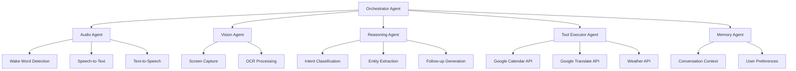

# Jarvis AI Assistant - Simplified MVP Plan

> **Project Vision**: Build a voice-activated AI assistant with wake word detection, calendar management, live translation, and weather queries using a streamlined multiagent architecture.

---

## 📋 Table of Contents

1. [Project Overview](#project-overview)
2. [Core Features (MVP)](#core-features-mvp)
3. [Multiagent Architecture](#multiagent-architecture)
4. [Technology Stack](#technology-stack)
5. [Implementation Roadmap](#implementation-roadmap)
6. [API Integrations](#api-integrations)

---

## 🎯 Project Overview

### Mission Statement

Create a practical, voice-activated AI assistant that handles everyday tasks: managing your calendar, translating text and speech in real-time, and providing weather updates.

### MVP Objectives

- ✅ Wake word detection ("Hey Jarvis")
- ✅ Google Calendar integration (add reminders & events)
- ✅ Live text translation via OCR + Google Translate
- ✅ Real-time speech-to-text translation
- ✅ Weather queries via API
- ✅ Intelligent follow-up questions when info is missing

### Target Users

- Students managing schedules
- Multilingual users needing quick translations
- Anyone wanting hands-free productivity

---

## 🚀 Core Features (MVP)

### 1. **Wake Word Detection**

**Trigger**: "Hey Jarvis"

**Functionality**:

- Continuous listening for wake word
- Activates the AI loop when detected
- Visual/audio feedback confirming activation
- Low CPU usage when idle

**Example**:

```
User: "Hey Jarvis"
Jarvis: *chime sound* "Yes, I'm listening."
```

---

### 2. **Calendar Management**

**Commands**:

- `"Hey Jarvis, remind me to take my creatine"`
- `"Add my DSA class to my calendar, from 4:30 to 5:00 on Wednesdays"`
- `"What's on my calendar today?"`
- `"Cancel my 3pm meeting"`

**Functionality**:

- Parse natural language for event details
- Extract: title, date, time, duration, recurrence
- Ask follow-up questions if info is missing
- Create/update/delete Google Calendar events
- Confirm actions before executing

**Follow-up Example**:

```
User: "Hey Jarvis, remind me to take my creatine"
Jarvis: "When would you like me to remind you?"
User: "Every day at 8 AM"
Jarvis: "Got it. I'll remind you to take your creatine daily at 8 AM. Should I add this to your calendar?"
User: "Yes"
Jarvis: "Done. Daily reminder created."
```

**Missing Info Handling**:

```
User: "Add my DSA class to my calendar"
Jarvis: "What time does your DSA class start?"
User: "4:30 PM"
Jarvis: "And when does it end?"
User: "5:00 PM"
Jarvis: "Which day of the week?"
User: "Wednesdays"
Jarvis: "Perfect. I've added DSA class to your calendar every Wednesday from 4:30 to 5:00 PM."
```

---

### 3. **Live Text Translation (OCR)**

**Command**: `"Hey Jarvis, translate this text"`

**Functionality**:

- Capture screenshot of current screen
- Run OCR to extract text
- Auto-detect source language (Google Translate API)
- Translate to user's preferred language (default: English)
- Display translation in HUD overlay

**Example**:

```
User: "Hey Jarvis, translate this text"
Jarvis: *captures screen* "I detected Spanish. The text says: 'Hello, how are you today?'"
```

**Advanced**:

- `"Translate this to French"` - specify target language
- `"What language is this?"` - language detection only

---

### 4. **Speech-to-Text Translation**

**Command**: `"Hey Jarvis, turn on speech translation"`

**Functionality**:

- Activate continuous listening mode
- Real-time speech-to-text transcription
- Auto-detect spoken language
- Translate to target language
- Display both original and translated text in HUD
- Toggle on/off

**Example**:

```
User: "Hey Jarvis, turn on speech translation"
Jarvis: "Speech translation activated. Listening..."
[Someone speaks in Spanish]: "¿Dónde está el baño?"
[HUD displays]:
  🇪🇸 Spanish: "¿Dónde está el baño?"
  🇺🇸 English: "Where is the bathroom?"
```

**Controls**:

- `"Turn off speech translation"` - deactivate
- `"Translate to Spanish"` - change target language

---

### 5. **Weather Queries**

**Commands**:

- `"Hey Jarvis, how's the weather?"`
- `"What's the weather like today?"`
- `"Will it rain tomorrow?"`
- `"Weather in New York"`

**Functionality**:

- Fetch weather data from API (OpenWeatherMap)
- Use user's location (or specified location)
- Provide current conditions and forecast
- Display in HUD with icons

**Example**:

```
User: "Hey Jarvis, how's the weather?"
Jarvis: "It's currently 72°F and sunny in San Francisco. High of 75°F today with no rain expected."
```

---

## 🤖 Multiagent Architecture

### Simplified Agent System

For the MVP, we need **5 core agents** working together:



---

### Agent Details

#### 1. **Orchestrator Agent** (Central Hub)

**Role**: Coordinates all agents and manages the conversation flow

**Responsibilities**:

- Receives wake word trigger from Audio Agent
- Routes user commands to appropriate agents
- Manages conversation state
- Handles multi-turn dialogues
- Coordinates follow-up questions

**Technology**: Python + asyncio

**Flow**:

```
Wake Word Detected → Activate Audio Agent (STT) →
Send to Reasoning Agent → Determine Intent →
Delegate to Tool Executor → Return Response →
Audio Agent (TTS)
```

---

#### 2. **Audio Agent** (Voice I/O)

**Role**: Handle all audio input and output

**Responsibilities**:

- Continuous wake word monitoring
- Speech-to-text conversion
- Text-to-speech output
- Audio feedback (chimes, confirmations)

**Tools**:

- **Wake Word**: Porcupine (offline, low latency)
- **STT**: OpenAI Whisper (accurate, multilingual)
- **TTS**: Google Cloud TTS or ElevenLabs

**States**:

- `IDLE`: Listening for wake word only
- `ACTIVE`: Full STT processing
- `TRANSLATION_MODE`: Continuous translation

---

#### 3. **Vision Agent** (Screen Analysis)

**Role**: Capture and process visual information

**Responsibilities**:

- Screenshot capture on demand
- OCR text extraction
- Language detection (visual)

**Tools**:

- **Screen Capture**: Python `mss` or `pyautogui`
- **OCR**: Google Cloud Vision API or Tesseract
- **Preprocessing**: OpenCV for image enhancement

**Only Active When**: User requests text translation

---

#### 4. **Reasoning Agent** (AI Brain)

**Role**: Understand user intent and manage conversation logic

**Responsibilities**:

- Intent classification (calendar, translation, weather, general)
- Entity extraction (dates, times, locations, languages)
- Determine if more info is needed
- Generate follow-up questions
- Context-aware responses

**Tools**:

- **LLM**: Google Gemini (via OpenRouter)
- **Framework**: LangChain for structured outputs
- **Prompt Engineering**: Function calling for tool selection

**Why OpenRouter**:

- Access to multiple models (Gemini, Claude, GPT, etc.)
- Cost-effective pricing (~$0.00015/1K tokens vs $0.03/1K for GPT-4)
- Unified API interface
- Easy model switching

**Intent Categories**:

```python
intents = [
    "calendar.create_event",
    "calendar.create_reminder",
    "calendar.query",
    "calendar.delete",
    "translation.text_ocr",
    "translation.speech_live",
    "translation.toggle",
    "weather.current",
    "weather.forecast",
    "general.conversation"
]
```

**Entity Extraction Example**:

```json
{
  "intent": "calendar.create_event",
  "entities": {
    "title": "DSA class",
    "start_time": "16:30",
    "end_time": "17:00",
    "day_of_week": "Wednesday",
    "recurrence": "weekly"
  },
  "missing": [],
  "confidence": 0.95
}
```

**Follow-up Logic**:

```python
if missing_entities:
    generate_question(missing_entities[0])
    wait_for_response()
    extract_entity_from_response()
    repeat_until_complete()
else:
    execute_action()
```

---

#### 5. **Tool Executor Agent** (API Integrations)

**Role**: Execute actions via external APIs

**Responsibilities**:

- Google Calendar operations (CRUD)
- Google Translate API calls
- Weather API requests
- Error handling and retries
- Response formatting

**Tools**:

- **Google Calendar API**: Create/read/update/delete events
- **Google Translate API**: Text translation + language detection
- **Weather API**: OpenWeatherMap or WeatherAPI.com

**Methods**:

```python
# Calendar
- create_event(title, start, end, recurrence)
- create_reminder(title, datetime)
- get_events(date_range)
- delete_event(event_id)

# Translation
- translate_text(text, target_lang, source_lang=None)
- detect_language(text)

# Weather
- get_current_weather(location)
- get_forecast(location, days)
```

---

#### 6. **Memory Agent** (Context & State)

**Role**: Maintain conversation history and user preferences

**Responsibilities**:

- Store conversation context (last 10 exchanges)
- Remember user preferences (default language, location)
- Track ongoing multi-turn dialogues
- Session management

**Storage**:

- **Short-term**: In-memory dict or Redis (current session)
- **Long-term**: SQLite or JSON file (preferences)

**Data Structure**:

```python
{
  "session_id": "uuid",
  "conversation_history": [
    {"role": "user", "content": "Hey Jarvis, remind me..."},
    {"role": "assistant", "content": "When would you like..."}
  ],
  "current_intent": "calendar.create_reminder",
  "pending_entities": {"time": None},
  "user_preferences": {
    "default_language": "en",
    "location": "San Francisco, CA",
    "calendar_id": "primary"
  }
}
```

**Why We Need It**:

- Multi-turn conversations require context
- Follow-up questions need to reference previous exchanges
- User preferences avoid repetitive questions

---

### Agent Communication Flow

#### Example: Calendar Event Creation

```
1. User: "Hey Jarvis, add my DSA class to my calendar"

2. Audio Agent (Wake Word) → Orchestrator
   - Wake word detected

3. Audio Agent (STT) → Orchestrator
   - Transcription: "add my DSA class to my calendar"

4. Orchestrator → Reasoning Agent
   - Classify intent & extract entities

5. Reasoning Agent → Orchestrator
   - Intent: calendar.create_event
   - Entities: {title: "DSA class"}
   - Missing: [start_time, end_time, day_of_week]

6. Orchestrator → Memory Agent
   - Store intent and partial entities

7. Orchestrator → Audio Agent (TTS)
   - "What time does your DSA class start?"

8. User: "4:30 PM"

9. Audio Agent (STT) → Orchestrator → Reasoning Agent
   - Extract: start_time = "16:30"
   - Still missing: [end_time, day_of_week]

10. Orchestrator → Audio Agent (TTS)
    - "And when does it end?"

11. User: "5:00 PM"

12. Reasoning Agent extracts: end_time = "17:00"
    - Still missing: [day_of_week]

13. Orchestrator → Audio Agent (TTS)
    - "Which day of the week?"

14. User: "Wednesdays"

15. Reasoning Agent extracts: day_of_week = "Wednesday"
    - All entities collected!

16. Orchestrator → Tool Executor Agent
    - create_event("DSA class", "16:30", "17:00", "weekly", "Wednesday")

17. Tool Executor → Google Calendar API
    - Event created successfully

18. Tool Executor → Orchestrator
    - Success response

19. Orchestrator → Audio Agent (TTS)
    - "Perfect. I've added DSA class to your calendar every Wednesday from 4:30 to 5:00 PM."
```

---

## 💻 Technology Stack

### Backend (Agent System)

| Component         | Technology                     | Purpose                             |
| ----------------- | ------------------------------ | ----------------------------------- |
| **Runtime**       | Python 3.11+                   | Agent orchestration                 |
| **Framework**     | FastAPI                        | API server (optional web interface) |
| **Async**         | asyncio                        | Concurrent agent execution          |
| **LLM**           | Google Gemini (via OpenRouter) | Reasoning agent                     |
| **LLM Framework** | LangChain                      | Structured outputs, tool calling    |
| **Wake Word**     | Porcupine                      | Offline wake word detection         |
| **STT**           | OpenAI Whisper                 | Speech-to-text                      |
| **TTS**           | Google Cloud TTS               | Text-to-speech                      |
| **OCR**           | Google Cloud Vision API        | Text extraction                     |
| **Memory**        | Redis (optional) / In-memory   | Session state                       |

### APIs & Services

| Service                     | Purpose                 | Cost                |
| --------------------------- | ----------------------- | ------------------- |
| **Google Calendar API**     | Event management        | Free (quota limits) |
| **Google Translate API**    | Translation + detection | $20/1M characters   |
| **Google Cloud Vision API** | OCR                     | $1.50/1000 images   |
| **OpenWeatherMap API**      | Weather data            | Free tier available |
| **OpenRouter API**          | LLM access (Gemini)     | ~$0.00015/1K tokens |
| **Porcupine**               | Wake word               | Free tier available |

### Frontend (Optional HUD)

| Component        | Technology             | Purpose               |
| ---------------- | ---------------------- | --------------------- |
| **UI Framework** | React + TypeScript     | Simple overlay UI     |
| **Styling**      | CSS                    | Minimal design        |
| **Display**      | Electron (desktop app) | Cross-platform window |

---

## 📅 Implementation Roadmap

### **Phase 1: Foundation** (Week 1-2)

#### Week 1: Project Setup & Wake Word

- [ ] Initialize Git repository
- [ ] Set up Python virtual environment
- [ ] Install core dependencies (asyncio, LangChain, OpenRouter)
- [ ] Implement Orchestrator Agent skeleton
- [ ] Integrate Porcupine wake word detection
- [ ] Test wake word → activation flow

**Deliverable**: "Hey Jarvis" triggers system activation

---

#### Week 2: Audio Agent & Basic Conversation

- [ ] Implement Audio Agent
- [ ] Integrate Whisper STT
- [ ] Integrate Google Cloud TTS
- [ ] Create simple echo test (Jarvis repeats what you say)
- [ ] Add audio feedback (chimes)

**Deliverable**: Full voice I/O working

---

### **Phase 2: Reasoning & Memory** (Week 3)

- [ ] Implement Reasoning Agent with LangChain
- [ ] Create intent classification system
- [ ] Build entity extraction with function calling
- [ ] Implement Memory Agent (in-memory for MVP)
- [ ] Test multi-turn conversation flow
- [ ] Create follow-up question logic

**Deliverable**: Jarvis can ask clarifying questions

---

### **Phase 3: Calendar Integration** (Week 4)

- [ ] Set up Google Calendar API credentials
- [ ] Implement Tool Executor Agent
- [ ] Build calendar CRUD methods
- [ ] Create date/time parsing logic
- [ ] Test event creation with all edge cases
- [ ] Add confirmation before calendar actions

**Deliverable**: Full calendar management working

**Test Cases**:

```
✓ "Remind me to take creatine at 8 AM daily"
✓ "Add DSA class Wednesdays 4:30-5:00 PM"
✓ "What's on my calendar today?"
✓ "Cancel my 3pm meeting"
```

---

### **Phase 4: Translation Features** (Week 5)

#### OCR Translation

- [ ] Implement Vision Agent
- [ ] Screen capture functionality
- [ ] Integrate Google Cloud Vision API
- [ ] Connect to Google Translate API
- [ ] Test with various languages and fonts

#### Speech Translation

- [ ] Add continuous listening mode
- [ ] Real-time STT + translation pipeline
- [ ] Create toggle on/off functionality
- [ ] Build HUD display for translations

**Deliverable**: Both translation modes working

**Test Cases**:

```
✓ "Translate this text" (Spanish menu → English)
✓ "Turn on speech translation" (French speech → English text)
✓ "Translate to Spanish" (English speech → Spanish text)
```

---

### **Phase 5: Weather & Polish** (Week 6)

- [ ] Integrate OpenWeatherMap API
- [ ] Location detection (IP-based or user preference)
- [ ] Weather query parsing
- [ ] Format weather responses
- [ ] Add weather icons/visuals (optional)
- [ ] Error handling for all agents
- [ ] Logging and debugging tools
- [ ] Performance optimization

**Deliverable**: Complete MVP ready for testing

**Test Cases**:

```
✓ "How's the weather?"
✓ "Will it rain tomorrow?"
✓ "Weather in New York"
```

---

### **Phase 6: Testing & Deployment** (Week 7)

- [ ] End-to-end testing of all features
- [ ] Edge case handling
- [ ] User acceptance testing
- [ ] Documentation (setup guide, API keys)
- [ ] Package for distribution
- [ ] Create demo video

**Deliverable**: Production-ready MVP

---

## 🔌 API Integrations

### 1. Google Calendar API

**Setup**:

```bash
pip install google-auth google-auth-oauthlib google-api-python-client
```

**Authentication**:

- Create project in Google Cloud Console
- Enable Google Calendar API
- Download OAuth 2.0 credentials
- First run: user authorizes access
- Token stored locally for future use

**Key Methods**:

```python
from googleapiclient.discovery import build

service = build('calendar', 'v3', credentials=creds)

# Create event
event = {
  'summary': 'DSA Class',
  'start': {'dateTime': '2026-01-22T16:30:00', 'timeZone': 'America/Los_Angeles'},
  'end': {'dateTime': '2026-01-22T17:00:00', 'timeZone': 'America/Los_Angeles'},
  'recurrence': ['RRULE:FREQ=WEEKLY;BYDAY=WE']
}
service.events().insert(calendarId='primary', body=event).execute()
```

---

### 2. Google Translate API

**Setup**:

```bash
pip install google-cloud-translate
```

**Usage**:

```python
from google.cloud import translate_v2

client = translate_v2.Client()

# Detect language
result = client.detect_language('Bonjour')
# {'language': 'fr', 'confidence': 0.99}

# Translate
result = client.translate('Hello', target_language='es')
# {'translatedText': 'Hola', 'detectedSourceLanguage': 'en'}
```

---

### 3. Google Cloud Vision API (OCR)

**Setup**:

```bash
pip install google-cloud-vision
```

**Usage**:

```python
from google.cloud import vision

client = vision.ImageAnnotatorClient()

with open('screenshot.png', 'rb') as image_file:
    content = image_file.read()

image = vision.Image(content=content)
response = client.text_detection(image=image)
texts = response.text_annotations

if texts:
    print(texts[0].description)  # Full extracted text
```

---

### 4. OpenWeatherMap API

**Setup**:

```bash
pip install requests
```

**Usage**:

```python
import requests

API_KEY = "your_key"
city = "San Francisco"
url = f"http://api.openweathermap.org/data/2.5/weather?q={city}&appid={API_KEY}&units=imperial"

response = requests.get(url).json()
temp = response['main']['temp']
description = response['weather'][0]['description']

print(f"{temp}°F and {description}")
```

---

### 5. OpenRouter API (LLM - Gemini)

**Setup**:

```bash
pip install openai  # OpenRouter uses OpenAI-compatible API
```

**Get API Key**:

- Sign up at [openrouter.ai](https://openrouter.ai/)
- Get your API key from dashboard
- Much cheaper than OpenAI: Gemini Flash ~$0.00015/1K tokens (200x cheaper than GPT-4!)

**Usage with Function Calling**:

```python
from openai import OpenAI

# OpenRouter uses OpenAI-compatible API
client = OpenAI(
    base_url="https://openrouter.ai/api/v1",
    api_key="your_openrouter_key"
)

tools = [
    {
        "type": "function",
        "function": {
            "name": "create_calendar_event",
            "description": "Create a new calendar event",
            "parameters": {
                "type": "object",
                "properties": {
                    "title": {"type": "string"},
                    "start_time": {"type": "string"},
                    "end_time": {"type": "string"},
                    "day_of_week": {"type": "string"},
                    "recurrence": {"type": "string", "enum": ["once", "daily", "weekly"]}
                },
                "required": ["title"]
            }
        }
    }
]

response = client.chat.completions.create(
    model="google/gemini-flash-1.5",  # or "google/gemini-pro-1.5"
    messages=[{"role": "user", "content": "Add my DSA class to my calendar"}],
    tools=tools,
    tool_choice="auto"
)

# Check if function call was made
if response.choices[0].message.tool_calls:
    function_call = response.choices[0].message.tool_calls[0]
    # Extract arguments and execute
```

**Available Gemini Models**:

- `google/gemini-flash-1.5` - Fast, cheap, great for most tasks (~$0.00015/1K tokens)
- `google/gemini-pro-1.5` - More capable, slightly more expensive (~$0.0005/1K tokens)
- `google/gemini-flash-1.5-8b` - Ultra-cheap for simple tasks (~$0.00004/1K tokens)

**LangChain Integration**:

```python
from langchain_openai import ChatOpenAI

llm = ChatOpenAI(
    model="google/gemini-flash-1.5",
    openai_api_key="your_openrouter_key",
    openai_api_base="https://openrouter.ai/api/v1"
)
```

---

## 🎯 Success Metrics

### MVP Goals

- **Wake Word Accuracy**: >95% detection rate
- **STT Accuracy**: >90% in quiet environments
- **Calendar Success Rate**: 100% when all info provided
- **Translation Accuracy**: Matches Google Translate quality
- **Response Time**: <3 seconds for most queries
- **Uptime**: Runs continuously without crashes

### User Experience

- **Onboarding**: <5 minutes to set up API keys
- **Learning Curve**: Intuitive voice commands
- **Reliability**: Handles missing info gracefully

---

## 🔐 Privacy & Security

### Data Handling

- **Audio**: Processed locally (Whisper can run offline)
- **Screenshots**: Temporary, deleted after OCR
- **Calendar**: OAuth 2.0, user controls access
- **Conversation**: Stored in memory, cleared on exit
- **API Keys**: Stored in `.env` file (not committed)

### User Control

- Wake word required (no always-on listening)
- Confirmation before calendar changes
- Clear data deletion on request

---

## 📝 Next Steps

### Immediate Actions

1. [ ] Review and approve simplified plan
2. [ ] Set up Google Cloud project (Calendar, Translate, Vision APIs)
3. [ ] Get OpenRouter API key (for Gemini access)
4. [ ] Get OpenWeatherMap API key
5. [ ] Initialize Python project structure
6. [ ] Start with Phase 1: Wake word detection

### Questions to Resolve

- [ ] Preferred TTS voice (male/female, accent)?
- [ ] Default translation target language?
- [ ] Run as terminal app or desktop app with UI?
- [ ] Budget for API costs (~$5-10/month for moderate use with Gemini)?

---

**Last Updated**: 2026-01-17  
**Version**: 2.0 (Simplified MVP)  
**Status**: Planning Phase

---

> "Sometimes you gotta run before you can walk." - Tony Stark

Let's build the essentials first, then expand! 🚀
