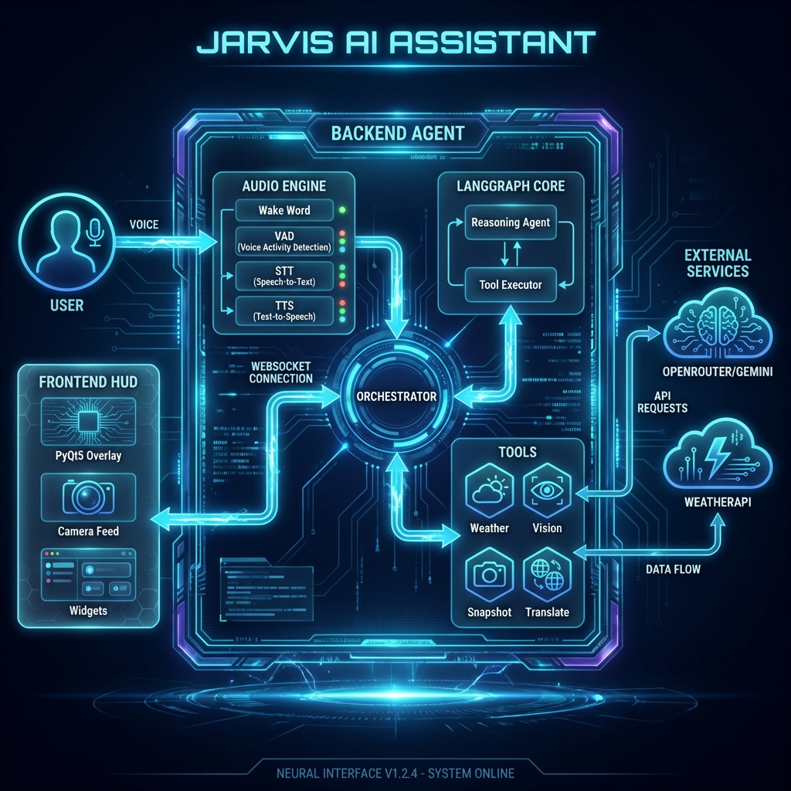

# 🤖 Jarviz AI Assistant

A futuristic voice-activated AI assistant inspired by Iron Man's JARVIS, featuring multimodal capabilities, real-time vision processing, and an immersive HUD overlay.

## 🏗️ Architecture



### Backend Stack

- **Framework**: Python asyncio
- **Agent Orchestration**: LangChain + LangGraph
- **LLM**:
  - Reasoning: GPT via OpenRouter
  - Vision: Qwen VL 32B via OpenRouter
- **STT**: OpenAI Whisper (local model)
- **TTS**: ElevenLabs WebSocket streaming
- **Wake Word**: OpenWakeWord (local, offline)
- **VAD**: WebRTC Voice Activity Detection
- **OCR**: EasyOCR
- **Translation**: Google Translate API
- **Communication**: WebSocket (websockets library)

### Frontend Stack

- **UI Framework**: PyQt5
- **Graphics**: OpenCV for camera feed
- **Rendering**: QPainter for HUD overlay
- **Animations**: Custom animation system with easing
- **Communication**: WebSocket client (async)

### Data Flow

```
User Voice → Wake Word → VAD → Whisper STT →
Reasoning Agent → LangGraph → Tools →
Response → ElevenLabs TTS → User
         ↓
    HUD Updates (WebSocket)
```

## ✨ Features

### 🎤 Voice Interaction

- **Wake Word Detection**: Activate with "Hey Jarvis" using OpenWakeWord (local, no API)
- **Voice Activity Detection**: Automatic speech detection using WebRTC VAD
- **Speech-to-Text**: OpenAI Whisper (local model)
- **Text-to-Speech**: ElevenLabs WebSocket streaming for natural voice

### 🧠 AI Capabilities

- **Intent Classification**: LangChain-powered reasoning agent with GPT
- **Multi-turn Conversations**: Context-aware dialogue with conversation memory
- **Tool Orchestration**: LangGraph workflow for intelligent task execution

### 🛠️ Tools & Features

1. **🌡️ Weather**: Real-time weather information for any location
2. **👁️ Vision Description**: Multimodal LLM (Qwen VL) describes camera surroundings
3. **📸 Snapshot Management**: Save and retrieve camera snapshots with HUD display
4. **🌍 OCR Translation**: Extract text from camera and translate to any language
5. **📍 Proximity Search**: Find distance to nearest landmarks using Google Maps

### 🎨 Futuristic HUD

- **Iron Man-Style Overlay**: Fullscreen transparent HUD with camera feed
- **Animated Widgets**: Weather widget, voice visualizer, snapshot viewer
- **Real-time State Sync**: WebSocket communication with backend
- **Smooth Animations**: Fade effects, pulsing borders, auto-hide timers

## 🚀 Quick Start

### Prerequisites

- Python 3.12+
- macOS (tested) or Linux
- Webcam/camera access

### Installation

1. **Clone and navigate:**

   ```bash
   cd Jarvis
   ```

2. **Install dependencies:**

   ```bash
   pip install -r requirements.txt
   ```

3. **Configure environment variables:**

   ```bash
   cp .env.example .env
   # Edit .env and add your API keys
   ```

4. **Required API Keys:**
   - `OPENROUTER_API_KEY`: For LLM (Gemini, Qwen VL via OpenRouter)
   - `ELEVENLABS_API_KEY`: For Text-to-Speech
   - `WEATHER_API_KEY`: For weather data (WeatherAPI.com)

### Running Jarviz

**Terminal 1 - Backend (Jarviz Agent):**

```bash
python main.py
```

**Terminal 2 - Frontend (HUD Overlay):**

```bash
python hud.py
```

## 🎮 Usage

### Voice Commands

**Activation:**

- "Hey Jarvis" - Wake up Jarviz

**Weather:**

- "What's the weather in Vancouver?"
- "How's the weather today?"

**Vision:**

- "Describe my surroundings"
- "What do you see?"

**Snapshots:**

- "Save a snapshot"
- "Show my snapshot"

**Translation:**

- "Translate this to English"
- "What does this say in Spanish?"
- "Translate to French"

**Maps / Proximity:**

- "How close is the nearest Starbucks?"
- "Where is the nearest gas station?"

### HUD Controls

- `ESC` or `Q`: Exit HUD
- `Ctrl+C`: Graceful shutdown

## 📁 Project Structure

```
Jarvis/
├── main.py                    # Backend entry point
├── hud.py                     # HUD overlay entry point
├── requirements.txt           # Python dependencies
├── .env                       # API keys (create from .env.example)
│
├── agents/                    # Backend AI agents
│   ├── audio/                # Audio I/O (STT, TTS, wake word, VAD)
│   ├── reasoning/            # Intent classification with LLM
│   ├── memory/               # Conversation history management
│   ├── tools/                # Tool implementations
│   │   ├── weather_tool.py   # Weather API integration
│   │   ├── vision_tool.py    # Multimodal vision LLM
│   │   ├── snapshot_tool.py  # Camera snapshot management
│   │   └── translation_tool.py # OCR + translation
│   ├── graph/                # LangGraph workflow orchestration
│   ├── orchestrator/         # Main agent orchestration
│   ├── camera_manager.py     # Camera frame management
│   └── hud_server.py         # WebSocket server for HUD
│
└── frontend/                 # HUD interface
    ├── widgets/              # UI widgets
    │   ├── weather_widget.py # Weather display
    │   ├── voice_widget.py   # Voice visualizer
    │   └── snapshot_widget.py # Snapshot viewer
    ├── graphics/             # Drawing utilities
    │   └── hud_painter.py    # HUD rendering functions
    ├── animations/           # Animation system
    │   └── animator.py       # Fade, pulse animations
    └── backend_client.py     # WebSocket client
```

## 🔧 Technologies

### AI & ML

- **LangChain**: Agent framework and tool orchestration
- **LangGraph**: Workflow state machine
- **OpenAI Whisper**: Local speech-to-text
- **EasyOCR**: Optical character recognition
- **Qwen VL**: Multimodal vision-language model

### Audio Processing

- **OpenWakeWord**: Wake word detection (local)
- **WebRTC VAD**: Voice activity detection
- **ElevenLabs**: Neural text-to-speech
- **sounddevice**: Audio I/O

### Computer Vision

- **OpenCV**: Camera capture and image processing
- **PyQt5**: HUD rendering and UI

### APIs & Services

- **OpenRouter**: LLM API gateway
- **WeatherAPI**: Weather data
- **Google Translate**: Translation service

## 🎯 Key Features Explained

### 1. Multimodal Vision

Uses Qwen VL 32B to analyze camera frames and provide detailed descriptions of surroundings, objects, people, and scenes.

### 2. Snapshot System

- Saves timestamped camera snapshots to `snapshots/` directory
- Maintains `latest.jpg` symlink for quick access
- HUD widget displays snapshots with futuristic animations
- Auto-fades after 10 seconds

### 3. OCR Translation

- Extracts text from camera using EasyOCR
- Translates to target language using Google Translate
- Supports 20+ languages (English, Spanish, French, German, etc.)
- Speaks both original and translated text

### 4. Intelligent Conversations

- Context-aware multi-turn dialogues
- Automatic followup question handling
- Conversation memory for natural flow
- Intent classification with confidence scoring

### 5. 📍 Proximity Search

- **Geo-Location**: Auto-detects user location via IP
- **Google Places API**: Finds nearest landmarks (Starbucks, Gas Stations, etc.)
- **Distance Calculation**: Provides exact distance and address

## 🐛 Troubleshooting

**Camera not working:**

- Check camera permissions in System Preferences
- Ensure no other app is using the camera

**Wake word not detecting:**

- Speak clearly: "Hey Jarvis"
- Check microphone permissions
- Adjust microphone volume

**HUD not connecting:**

- Ensure backend is running first
- Check WebSocket connection on port 8765

**API errors:**

- Verify all API keys in `.env`
- Check internet connection
- Ensure API quotas aren't exceeded

## 📝 License

MIT License - feel free to use and modify!

## 🙏 Acknowledgments

- Inspired by Iron Man's
- Built with LangChain and LangGraph
- Powered by OpenRouter, ElevenLabs, and OpenAI
