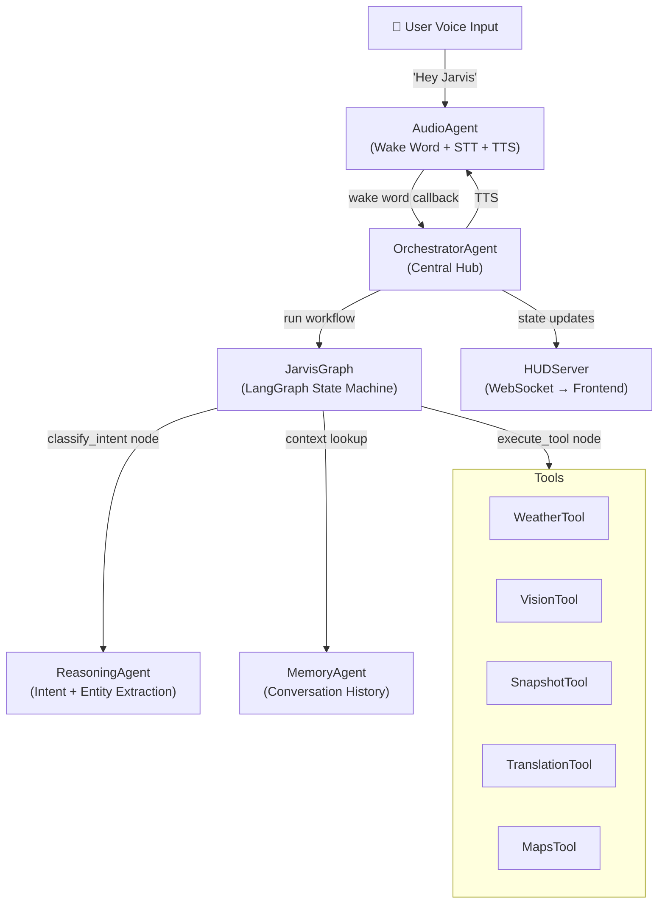
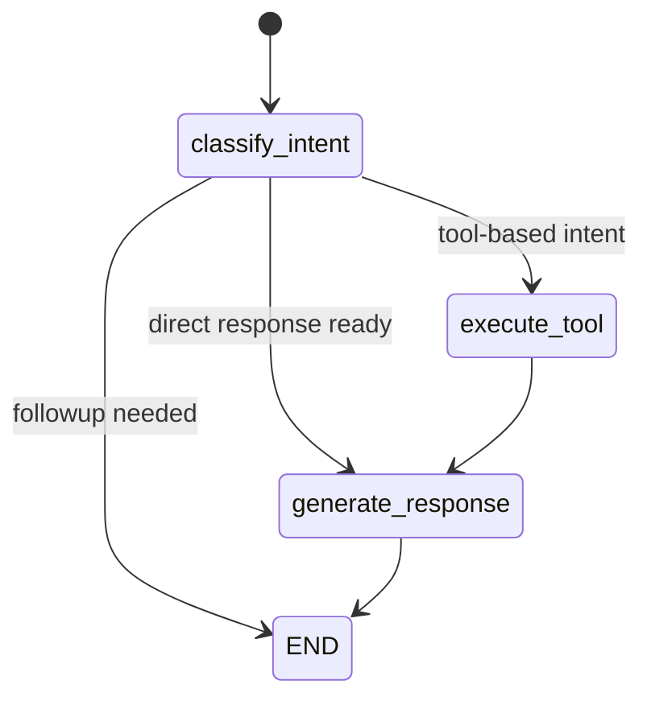
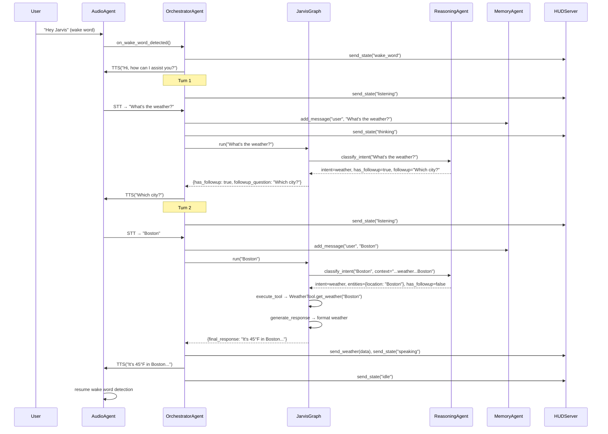

# Jarvis Agent Orchestration & Intent Classification

## High-Level Architecture

Jarvis uses a **hub-and-spoke orchestration pattern** centered on the [OrchestratorAgent](file:///Users/harshamin/Desktop/Projects/Jarvis-nwhacks2026/Jarvis/agents/orchestrator/__init__.py#14-214), with a **LangGraph state machine** ([JarvisGraph](file:///Users/harshamin/Desktop/Projects/Jarvis-nwhacks2026/Jarvis/agents/graph/__init__.py#36-272)) driving the conversation workflow. Intent classification is performed by a **single LLM call** in the [ReasoningAgent](file:///Users/harshamin/Desktop/Projects/Jarvis-nwhacks2026/Jarvis/agents/reasoning/__init__.py#44-322) that returns structured output via Pydantic.



---

## Component Breakdown

### 1. OrchestratorAgent — [orchestrator/\_\_init\_\_.py](file:///Users/harshamin/Desktop/Projects/Jarvis-nwhacks2026/Jarvis/agents/orchestrator/__init__.py)

The **central coordinator**. It owns all other agents and manages the full conversation lifecycle.

**Key responsibilities:**
- **Bootstrap**: Initializes all sub-agents, tools, camera, LangGraph, and HUD server on [start()](file:///Users/harshamin/Desktop/Projects/Jarvis-nwhacks2026/Jarvis/agents/orchestrator/__init__.py#L28-L76)
- **Conversation loop**: Runs a multi-turn loop (max 10 turns) inside [on_wake_word_detected()](file:///Users/harshamin/Desktop/Projects/Jarvis-nwhacks2026/Jarvis/agents/orchestrator/__init__.py#L78-L199)
- **State broadcasting**: Pushes state transitions (`idle → wake_word → listening → thinking → speaking`) to the HUD via WebSocket
- **Special-case handling**: Dispatches weather data, snapshot data, and maps data to the HUD; handles [self_destruct](file:///Users/harshamin/Desktop/Projects/Jarvis-nwhacks2026/Jarvis/agents/hud_server.py#170-176) by terminating the process

**Conversation loop flow:**
```
Wake word detected
  → Greet user ("Hi, how can I assist you?")
  → Loop (max 10 turns):
      1. Listen (STT)
      2. Add user message to MemoryAgent
      3. Run JarvisGraph workflow
      4. If result has followup → speak followup, continue loop
      5. Else → speak final response, break & return to idle
```

---

### 2. JarvisGraph (LangGraph Workflow) — [graph/\_\_init\_\_.py](file:///Users/harshamin/Desktop/Projects/Jarvis-nwhacks2026/Jarvis/agents/graph/__init__.py)

A **3-node LangGraph `StateGraph`** that processes each user turn:



#### State Schema ([ConversationState](file:///Users/harshamin/Desktop/Projects/Jarvis-nwhacks2026/Jarvis/agents/graph/__init__.py#16-34))
| Field              | Type          | Purpose                                              |
|--------------------|---------------|------------------------------------------------------|
| [messages](file:///Users/harshamin/Desktop/Projects/Jarvis-nwhacks2026/Jarvis/agents/memory/__init__.py#47-62)         | `List`        | Message history (currently unused within graph)       |
| `user_input`       | [str](file:///Users/harshamin/Desktop/Projects/Jarvis-nwhacks2026/Jarvis/agents/orchestrator/__init__.py#14-214)         | Raw user transcription                               |
| [intent](file:///Users/harshamin/Desktop/Projects/Jarvis-nwhacks2026/Jarvis/agents/reasoning/__init__.py#78-322)           | [str](file:///Users/harshamin/Desktop/Projects/Jarvis-nwhacks2026/Jarvis/agents/orchestrator/__init__.py#14-214)         | Classified intent value                              |
| `confidence`       | `float`       | Classification confidence (0–1)                      |
| `entities`         | `dict`        | Extracted entities (location, language, query, etc.)  |
| `has_followup`     | `bool`        | Whether the agent needs to ask a followup question   |
| `followup_question`| `str \| None` | The followup to ask                                  |
| `tool_result`      | `dict \| None`| Raw result from tool execution                       |
| `final_response`   | `str \| None` | Formatted natural-language response                  |

#### Nodes

1. **[classify_intent](file:///Users/harshamin/Desktop/Projects/Jarvis-nwhacks2026/Jarvis/agents/reasoning/__init__.py#78-322)** — Calls `ReasoningAgent.classify_intent()` with conversation context from [MemoryAgent](file:///Users/harshamin/Desktop/Projects/Jarvis-nwhacks2026/Jarvis/agents/memory/__init__.py#15-92). Populates [intent](file:///Users/harshamin/Desktop/Projects/Jarvis-nwhacks2026/Jarvis/agents/reasoning/__init__.py#78-322), `entities`, `has_followup`, and optionally `final_response` (for small talk/general questions).

2. **[execute_tool](file:///Users/harshamin/Desktop/Projects/Jarvis-nwhacks2026/Jarvis/agents/graph/__init__.py#110-204)** — Dispatches to the appropriate tool based on `state["intent"]`:
   - [weather](file:///Users/harshamin/Desktop/Projects/Jarvis-nwhacks2026/Jarvis/agents/hud_server.py#105-117) → `WeatherTool.get_weather(location)`
   - `vision` → `VisionTool.describe_surroundings(custom_prompt=...)`
   - `snapshot_save` → `SnapshotTool.save_snapshot()`
   - `snapshot_retrieve` → `SnapshotTool.get_latest_snapshot()`
   - [translate](file:///Users/harshamin/Desktop/Projects/Jarvis-nwhacks2026/Jarvis/agents/tool_executor/__init__.py#36-41) → `TranslationTool.translate_from_camera(target_lang)`
   - `distance` → `MapsTool.get_nearest_place(query)`

3. **[generate_response](file:///Users/harshamin/Desktop/Projects/Jarvis-nwhacks2026/Jarvis/agents/graph/__init__.py#205-234)** — Formats the `tool_result` into a natural-language string using each tool's `format_*_response()` method.

#### Routing Logic ([_route_after_classification](file:///Users/harshamin/Desktop/Projects/Jarvis-nwhacks2026/Jarvis/agents/graph/__init__.py#235-247))

```python
if has_followup and followup_question:
    return "followup"     # → END (orchestrator speaks the followup & loops)
elif final_response:
    return "response"     # → generate_response (just passes through)
else:
    return "tool"         # → execute_tool → generate_response
```

---

### 3. ReasoningAgent (Intent Classification) — [reasoning/\_\_init\_\_.py](file:///Users/harshamin/Desktop/Projects/Jarvis-nwhacks2026/Jarvis/agents/reasoning/__init__.py)

The **brain** of the system. Uses a single LLM call with **structured output** to classify intent and extract entities simultaneously.

#### Intent Enum

| Intent               | Description                                  | Requires Tool? |
|----------------------|----------------------------------------------|----------------|
| [weather](file:///Users/harshamin/Desktop/Projects/Jarvis-nwhacks2026/Jarvis/agents/hud_server.py#105-117)            | Weather conditions query                     | ✅ WeatherTool |
| `vision`             | Describe camera view / answer visual Q&A     | ✅ VisionTool  |
| `snapshot_save`      | Save a camera snapshot                       | ✅ SnapshotTool|
| `snapshot_retrieve`  | Retrieve a saved snapshot                    | ✅ SnapshotTool|
| [translate](file:///Users/harshamin/Desktop/Projects/Jarvis-nwhacks2026/Jarvis/agents/tool_executor/__init__.py#36-41)          | OCR + translate text from camera             | ✅ TranslationTool |
| `distance`           | Proximity/location search                    | ✅ MapsTool    |
| [self_destruct](file:///Users/harshamin/Desktop/Projects/Jarvis-nwhacks2026/Jarvis/agents/hud_server.py#170-176)      | Terminate the system                         | ❌ Special case |
| `did_i_miss_anything`| Hardcoded status check response              | ❌ Direct      |
| `small_talk`         | Greetings, casual conversation               | ❌ LLM response|
| `general_question`   | General knowledge Q&A                        | ❌ LLM response|
| `unknown`            | Fallback                                     | ❌ Error       |

#### How Classification Works

1. **LLM**: Gemini 3 Flash Preview via OpenRouter (`google/gemini-3-flash-preview`), `temperature=0.3`
2. **Structured Output**: Uses LangChain's `.with_structured_output(IntentClassification)` to force the LLM to return a Pydantic model
3. **System Prompt**: A comprehensive prompt (~280 lines) with:
   - Intent definitions and descriptions
   - Entity extraction rules (e.g., `vision_query`, `location`, [language](file:///Users/harshamin/Desktop/Projects/Jarvis-nwhacks2026/Jarvis/agents/tool_executor/__init__.py#42-47), `query`)
   - Followup logic rules (when to ask vs. execute immediately)
   - ~12 few-shot examples covering each intent
4. **Context-Aware**: Conversation history from [MemoryAgent](file:///Users/harshamin/Desktop/Projects/Jarvis-nwhacks2026/Jarvis/agents/memory/__init__.py#15-92) is appended to the system prompt
5. **Timeout**: 30-second `asyncio.wait_for` to prevent hangs
6. **Fallback**: Returns `Intent.UNKNOWN` with `confidence=0.0` on any error

#### Structured Output Schema ([IntentClassification](file:///Users/harshamin/Desktop/Projects/Jarvis-nwhacks2026/Jarvis/agents/reasoning/__init__.py#34-42))

```python
class IntentClassification(BaseModel):
    intent: Intent              # The classified intent
    confidence: float           # 0.0 – 1.0
    entities: Dict[str, Any]    # Extracted entities (location, language, etc.)
    has_followup: bool          # Does the agent need more info?
    followup_question: str?     # What to ask (if has_followup=True)
    response: str?              # Direct response (small_talk/general_question only)
```

#### Followup Decision Logic (embedded in system prompt)

| Condition | `has_followup` | Action |
|-----------|---------------|--------|
| Missing required info (e.g., "What's the weather?" — no location) | `True` | Ask followup question |
| Ambiguous input needing clarification | `True` | Ask followup question |
| All info present for tool execution | `False` | Execute tool immediately |
| Small talk / general question | `False` | Respond directly in [response](file:///Users/harshamin/Desktop/Projects/Jarvis-nwhacks2026/Jarvis/agents/hud_server.py#131-143) field |
| Vision, snapshot, translate, distance, self_destruct | `False` | Execute immediately (camera always available) |

---

### 4. Supporting Agents

#### MemoryAgent — [memory/\_\_init\_\_.py](file:///Users/harshamin/Desktop/Projects/Jarvis-nwhacks2026/Jarvis/agents/memory/__init__.py)
- In-memory conversation history (no persistence)
- Stores [(timestamp, role, message, intent)](file:///Users/harshamin/Desktop/Projects/Jarvis-nwhacks2026/Jarvis/agents/graph/__init__.py#248-272) tuples, capped at 50 messages
- Provides [get_conversation_context()](file:///Users/harshamin/Desktop/Projects/Jarvis-nwhacks2026/Jarvis/agents/memory/__init__.py#63-80) — formatted last-5-messages string injected into the LLM's system prompt for context-aware classification

#### AudioAgent — [audio/\_\_init\_\_.py](file:///Users/harshamin/Desktop/Projects/Jarvis-nwhacks2026/Jarvis/agents/audio/__init__.py)
- **Wake word**: OpenWakeWord (`hey_jarvis` model), 0.9 confidence threshold
- **STT**: Whisper `small` model, fixed 5-second recording window
- **TTS**: ElevenLabs WebSocket streaming API (primary), OpenAI TTS (fallback)
- **VAD**: WebRTC VAD at aggressiveness level 3

#### HUDServer — [hud_server.py](file:///Users/harshamin/Desktop/Projects/Jarvis-nwhacks2026/Jarvis/agents/hud_server.py)
- WebSocket server on `ws://localhost:8765`
- Broadcasts state transitions, transcriptions, responses, weather/snapshot/maps data to connected frontends

#### CameraManager — [camera_manager.py](file:///Users/harshamin/Desktop/Projects/Jarvis-nwhacks2026/Jarvis/agents/camera_manager.py)
- Thread-safe singleton for shared camera access (OpenCV)
- Used by VisionTool, SnapshotTool, and TranslationTool

---

## End-to-End Flow Example

Here's what happens when a user says **"What's the weather?"**:



---

## Key Design Decisions

1. **Single LLM call for everything**: Intent classification, entity extraction, followup decision, and direct responses are all handled in one structured-output call — no multi-step chains or separate classifiers.

2. **LangGraph for flow control, not LLM chaining**: The graph is a simple 3-node pipeline, not a complex agentic loop. The LLM only runs once (classification); tools and response formatting are deterministic.

3. **Multi-turn via orchestrator loop, not graph recursion**: The conversation loop lives in the orchestrator (`for turn in range(max_turns)`), not inside LangGraph. Each graph invocation is single-pass.

4. **Camera-based intents skip followup**: Vision, snapshot, translate, and distance intents always execute immediately since the camera is always available — no "which camera?" followups.

5. **Separation of state broadcast and logic**: The orchestrator handles HUD state broadcasting at every transition point, keeping the graph/reasoning layers unaware of the frontend.
